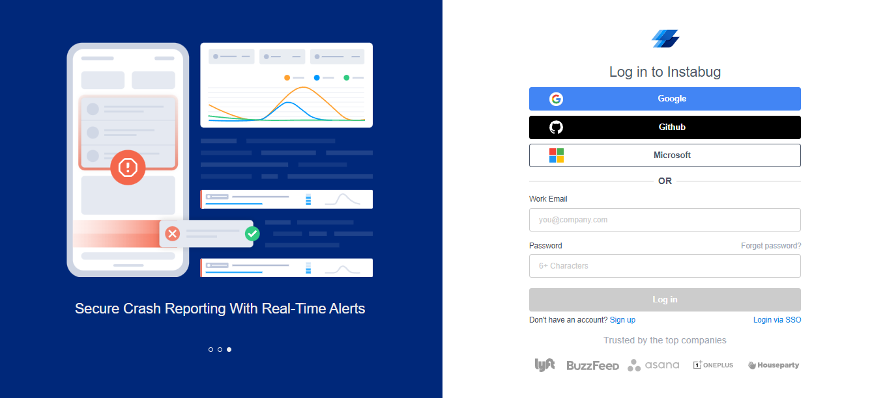

# Instabug-frontend-intern-task

<div id="top"></div>


<!-- PROJECT LOGO -->
<div align="center">
<br>
<a href="https://instabug-frontend-intern-task-a2fnwyizk-abdrahmansoltan.vercel.app/login">
    
  </a>
<br>
<br>

  <p align="center">
  <a href="https://instabug-frontend-intern-task-a2fnwyizk-abdrahmansoltan.vercel.app/login">View Demo</a>
    ·
    <a href="https://github.com/abdrahmansoltan/Instabug-Frontend-Intern-task/issues">Report Bug</a>
  </p>
</div>

<!-- TABLE OF CONTENTS -->
<details>
  <summary>Table of Contents</summary>
  <ol>
    <li>
      <a href="#about-the-project">About The Project</a>
      <ul>
        <li><a href="#built-with">Built With</a></li>
        <li><a href="#users">Users</a></li>
      </ul>
    </li>
    <li>
      <a href="#getting-started">Getting Started</a>
      <ul>
        <li><a href="#installation">Installation</a></li>
        <li><a href="#ports">Ports</a></li>
      </ul>
    </li>
    <li><a href="#contributing">Contributing</a></li>
  </ol>
</details>

<!-- ABOUT THE PROJECT -->

## About The Project

Small app that consists of 3 pages (login. Welcome, 404) pages using vue.js



### Users

| Email                 | Password  |
| --------------------- | --------- |
| mohamed@instabug.com  | A12345678 |
| mohamed1@instabug.com | A12345678 |
| mohamed2@instabug.com | A12345678 |
| mohamed3@instabug.com | A12345678 |
| mohamed4@instabug.com | A12345678 |
| mohamed5@instabug.com | A12345678 |
| mohamed6@instabug.com | A12345678 |
| mohamed7@instabug.com | A12345678 |

#### Validation

- **Email validation**: as per **RFC2822** standards.
- **Password validation**:
  - The password must be more than **6** characters.
  - The password must contain at least **1** uppercase letter and **1** number and **shouldn’t contain the email address name** (the part that came before the `@`).

### Built With

- Vue
- Javascript
- Sass
- Cypress

<p align="right">(<a href="#top">back to top</a>)</p>

---

<!-- GETTING STARTED -->

## Getting Started

This project require some perquisites and dependencies to be installed, you can view it online using this [demo](https://instabug-frontend-intern-task-a2fnwyizk-abdrahmansoltan.vercel.app/login). or you can find the instructions below:

> To get a local copy, follow these simple steps :

### Installation

1. Clone the repo
   ```sh
   git clone https://github.com/abdrahmansoltan/Instabug-Frontend-Intern-task.git
   ```
2. Go to project folder

   ```sh
   cd instabug-frontend-intern-task
   ```

3. Install dependencies

   ```bash
   npm run install
   ```

4. Lints and fixes files

   ```bash
   npm run lint
   ```

5. Run development server

   ```sh
   npm start
   ```

6. Run Tests

   ```sh
   npm test
   ```

#### Ports

- Server runs on port `8080`

<p align="right">(<a href="#top">back to top</a>)</p>

---

<!-- CONTRIBUTING -->

## Contributing

Contributions are what make the open source community such an amazing place to learn, inspire, and create. Any contributions you make are **greatly appreciated**.

If you have a suggestion that would make this better, please fork the repo and create a pull request. You can also simply open an issue with the tag "enhancement".
Don't forget to give the project a star! Thanks again!

1. Fork the Project
2. Create your Feature Branch (`git checkout -b feature/AmazingFeature`)
3. Commit your Changes (`git commit -m 'Add some AmazingFeature'`)
4. Push to the Branch (`git push origin feature/AmazingFeature`)
5. Open a Pull Request

<p align="right">(<a href="#top">back to top</a>)</p>
